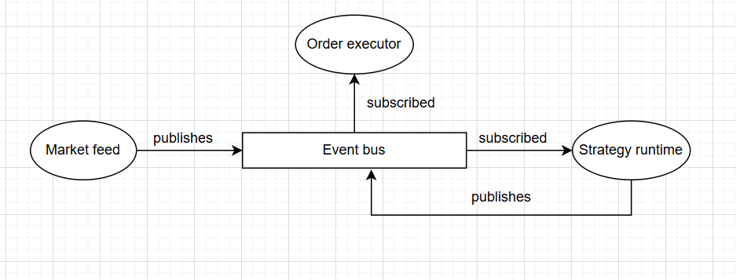

## Architecture & Flow:



| Component        | Event      | Role  |
| ---------------- | ---------- | ----- |
| Market Generator | publishes  | TICK  |
| StrategyRuntime  | subscribes | TICK  |
| StrategyRuntime  | publishes  | ORDER |
| OrderExecutor    | subscribes | ORDER |

Files:
* core/events.py to define the type of event in the log - acts as a pub/sub system
* market/dummy_stocks_data_generator.py emits simulated price ticks every second
* market/order_executor.py logs simulated BUY / SELL orders 
* strategy/runtime.py evaluates entry, exit, and risk independently. Risk strategy is  PnL is calculated in real time, and forced exits are triggered immediately when max loss or max profit thresholds are breached.
* strategy/manager.py responsible for starting and shutting down strategy execution whenever it sees a stock 

### Graceful shutdown

* As the market closing hour is hit, a shutdown event is fired and market data feed is stopped and summary is printed:

Total strategies
Successfully completed
Force-closed
Failed strategies (if any)

* At any given point, there is a possibility that a specific strategy's entry condiiton is never met so it is not recorded in the above summary.

## Concurrency Model:
* Built using asyncio
* One event loop
* Multiple async tasks
* No threads or blocking calls

### Key guarantees:
* Market feed never blocks
* Strategies run concurrently
* One strategy failure does not affect others

### How to run using Docker:
* Using Dockerfile to build app's image, and docker-compose to start the container
```bash
docker compose up --build
```

## How to run without Docker:
* Add the following variables one by one in powershell session
```
$env:DEFAULT_PRICE=20110
$env:PRICE_FLUCTUATION=10
$env:DEFAULT_INDEX="NIFTY"
$env:MARKET_CLOSE="15:20"
```
* Run the following command:
```
python main.py
```

You can also change values of DEFAULT_PRICE, PRICE_FLUCTUATION and MARKET_CLOSE and play around with the strategies

## Configuration handling:
* No hard-coded strings/numbers, all are fed into the container's environment using docker-compose.yml

## Logging & health checks:
* main.py has the configured root logger, 
    format: "%(asctime)s [%(levelname)s] [%(name)s] %(message)s"
* All loggers propagate to the root logger
* To check health/liveness of the strategies, run the following command:
```
python main.py --health
```

## Production improvements you would add:
* I will replace eval() in condition.py with some specific rules/DSL to adhere to security practices
* I would enable/disable an order execution or strategy execution at runtime
* I have provided strategies for only NIFTY based stocks, can be expanded to other indexes
* I will add the count of those strategies in the health check summary whose entry conditions never met in the market hours
* If one or more strategies fail, then will implement a circuit breaker that would disable one or more strategies during runtime
* Currently the health check function does not diagnose if there are any inactive strategies during runtime, will add that

